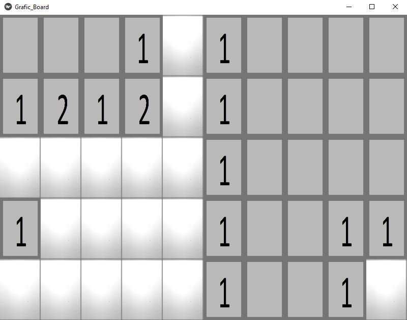
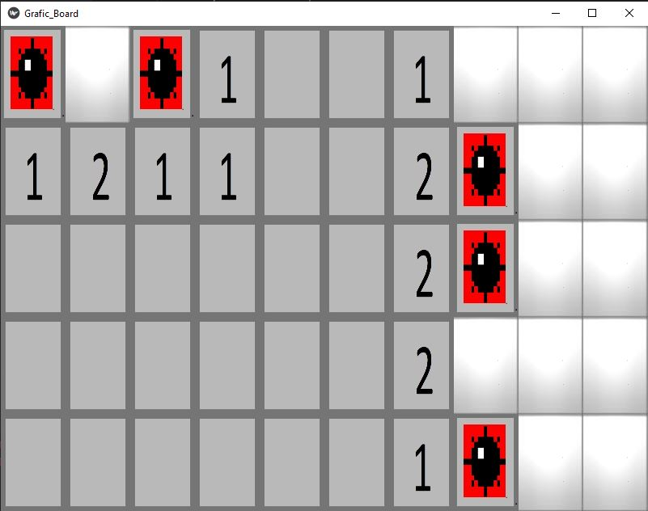
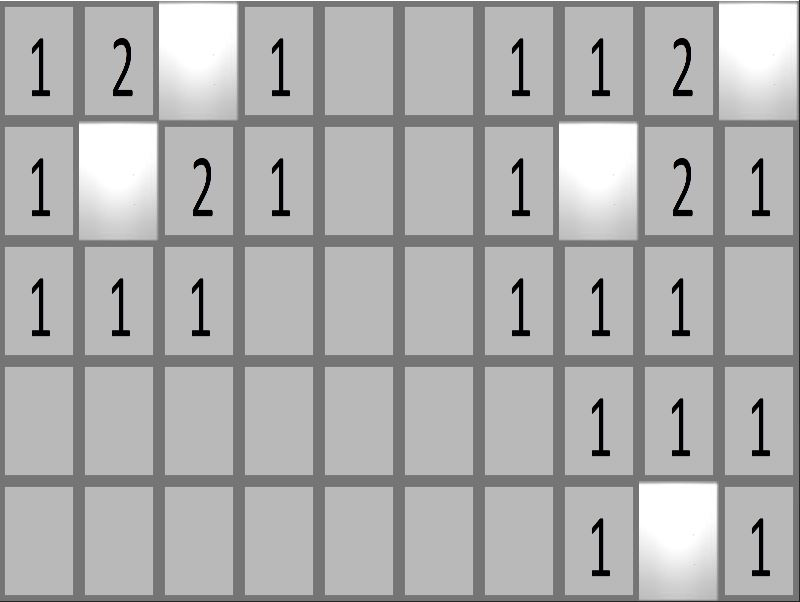

# Minesweeper


## Description
This program displays a kivy based GUI for the minesweeper game. The program 
contains 2 classes - one for the creation of the game board and the other one for
the game's GUI. The program creates an 5*10 game board and randomizes 
positions for the bombs. The board contains 10% of bombs. Then, the program 
updates the number of bomb neighbors for each of the squares in the board.
The GUI class receives that board and enables the user to play the game
with this board.


## Usage
1. run "minesweeper.py" file.

2. You will see a board with blank squares, press one of them to begin
playing.
<p align="center">
  
</p>

3. You need to press only the squares you think there is no bomb at. Unlike 
the regular game, don't press a square with the right mouse button if you think it contains a bomb.

5. If you press on a square with a bomb, you lose and all the bombs will be revealed. If you press on a square
that has no bomb neighbors, all the near squares without bomb
neighbors will be revealed recursively in addition to all the neighbor squares with bomb neighbors.
If you press on a square that has bomb neighbors,
the number of bomb neighbors it has will be revealed. 

<p align="center">
  
</p>
5. You will win after you pressed on all the squares without bombs.

<p align="center">
  
</p>


## Requirements
1. 
```bash
pip install -r requirments.txt
```
